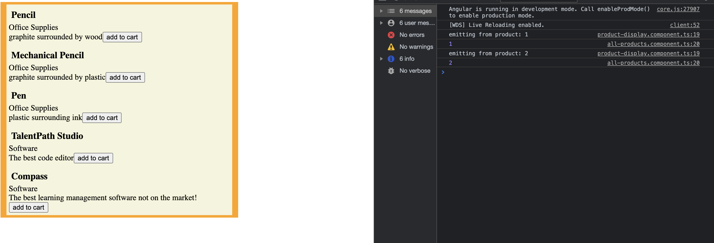

## Introduction ##
Now that we've covered inputting data from a parent component to a child component, we're going to be exploring how to pass data up from a child component to a parent component. In this example, we're going to be using outputs from our child product-display component to update our parent all-products component.

## Cart Model ##
The first thing we'll be doing is creating an interface to represent our cart. Create a new file in our app folder named cartItem.ts. We'll be defining a interface CartItem that has two properties:

`` itemId, quantity ``

```Typescript 
export interface CartItem {
    itemId:number,
    quantity:number
}
```

* Now that we have this model, in ``all-products.component.ts`` initialize a local variable ``cart`` to hold the items in our customer's cart.


```Typescript

@Component({
  selector: 'app-all-products',
  templateUrl: './all-products.component.html',
  styleUrls: ['./all-products.component.css']
})
export class AllProductsComponent implements OnInit {
  products: Product[];
  cart: CartItem[];
  constructor() { }

  ngOnInit(): void {
    this.products = [...productDataSource];
    this.cart = [];
  }

}
```

* next, we're going to create a html element to display our cart's information

```html
<div>
    <div id="cartDisplay" *ngFor="let item of cart">
        <span>item:{{item.itemId}} quantity:{{item.quantity}}</span>
    </div>
    <app-product-display *ngFor="let product of products" [product]="product"></app-product-display>
</div>
```

Now that we have our setup for the cart we can dive into emitting data from our child components.


## Creating a Custom Emitter ##

* Navigate to the ``product-display.component.html``
* Create a button element as shown below

```html
<div>
    <h3>{{product.name}}</h3>
    <span>{{product.category}}</span>
    <br>
    <span>{{product.description}}</span>
    <button (click)="addToCart()">add to cart</button>
</div>
```

You'll notice a new bit of syntax. the parenthesis on ``(click)`` represents a binding syntax that will bind the click event of the button to an expression from our typescript. In this case, that expression will be a function called ``addToCart``

* navigate to ``product-display.component.ts`` and add a new Event Emitter as a property with the annotation ``@Output()``

```Typescript
export class ProductDisplayComponent implements OnInit {
  @Input() product: Product;
  @Output() cartEmitter: EventEmitter<any> = new EventEmitter();
  constructor() { }

  ngOnInit(): void {

  }

}
```

this Event Emitter will the be the property that outputs up to our parent component to add items to our cart. 

* Create the method AddToCart() that will use the emitter to emit data about what item to add to our cart.

```Typescript
xport class ProductDisplayComponent implements OnInit {
  @Input() product: Product;
  @Output() cartEmitter: EventEmitter<any> = new EventEmitter();
  constructor() { }

  ngOnInit(): void {

  }
  addToCart():void {
    console.log('emitting from product: '+this.product.id)
    this.cartEmitter.emit(this.product.id);
  }

}
```
Now that we're able to emit from the child component, we have to listen for the event in our parent component.

* Navigate to ``all-products.component.html``
* add the following to our ``<app-product-display>`` component:
    * ``(cartEmitter)="addToCart($event)" ``

```html
<div>
    <div id="cartDisplay" *ngFor="let item of cart">
        <span>item:{{item.itemId}} quantity:{{item.quantity}}</span>
    </div>
    <app-product-display (cartEmitter)="addToCart($event)" *ngFor="let product of products" [product]="product"></app-product-display>
</div>
```

This creates a listener for the cartEmitter event and will pass the ``$event`` to the ``addToCart`` function on our parent component.

* Lets create a function in ``all-products.component.ts`` to capture that data and update our cart.
* first, lets console.log the event to get an idea of whats stored in this event


```Typescript
  addToCart(id):void {
    console.log(id);
  }
```



As you can see, we have visible console logs from both of our methods.
Now, lets add functionality that creates a cart item and adds that increments the quantity if the item exists or creates and adds the CartItem to our cart.

```Typescript
  addToCart(id):void {
    console.log(id);
    let toAdd = this.cart.find(item => item.itemId === id);
    if(toAdd) toAdd.quantity++;
    else this.cart.push({itemId:id, quantity:1})
  }
```

Now, pressing the add to cart button on our website should add 


