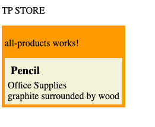
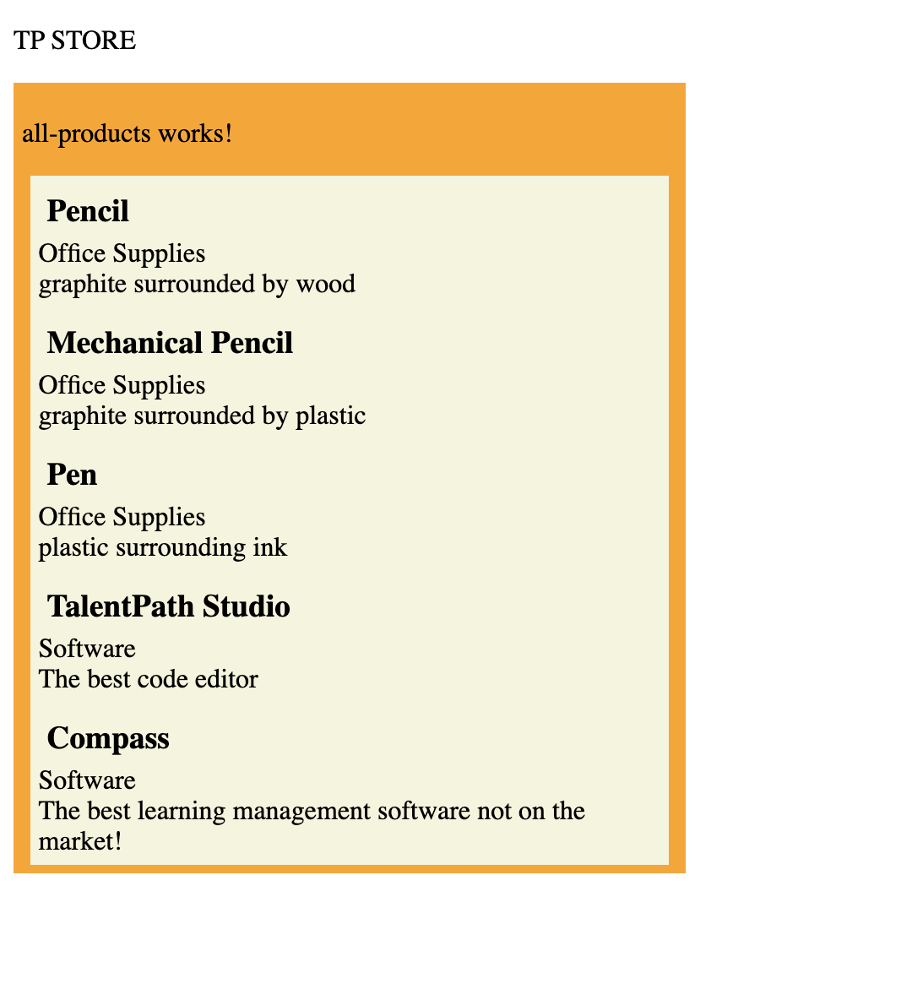

## Generating the  Container  ##

Now that we've styled our individual component, we're going to programatically generate a productDisplay component for each of our products.

* In your terminal, generate a new component named all components
* ``ng generate component components/all-products``

This component will serve as a container that holds all of our individual product display components.

## Nesting Components ##
* Navigate to your ``app.component.html`` and replace the selector for the individual product display with the selector for the all products display

```html
<p>{{title.toUpperCase()}}</p>
<app-all-products></app-all-products>
```

* Navigate to your ``all-products.component.html`` and add the selector for the indivudual product display

```html
<div>
<p>all-products works!</p>
<app-product-display></app-product-display>
</div>
```

to create some visual clarity of  the component, create a div to contain the component and style it like this:

```css
div {
    background-color: orange;
    width: fit-content;
    padding: 5px;
}
```
the end result should look like this



## Get Products from our productDataSource[] ##

* navigate to all-products.component.ts
* declare a products array to store our products on the component
* in the ``ngOnInit``, set the local ``products`` array to a copy of our ``productDataSource`` 

``` Typescript
import { Component, OnInit } from '@angular/core';
import { Product, productDataSource } from 'src/app/product';

@Component({
  selector: 'app-all-products',
  templateUrl: './all-products.component.html',
  styleUrls: ['./all-products.component.css']
})
export class AllProductsComponent implements OnInit {
  products: Product[];
  constructor() { }

  ngOnInit(): void {
    this.products = [...productDataSource];
  }

}
```

Now that we have our list of products, we can use that list to generate a series of product display components with ``*ngFor``

``*ngFor`` structural directive that renders a template for each item in a collection. The directive is placed on an element, which becomes the parent of the cloned templates. 

[read more about ngFor](https://angular.io/api/common/NgForOf)

* In your ``all-products.component.html`` add the ``*ngFor`` selector to your ``app-product-display`` tag

```html
    <div>
    <p>all-products works!</p>
    <app-product-display *ngFor="let product of products"></app-product-display>
</div>
```

this will create a product display component for each item in our ``products:Product[]`` array in our typescript. 


That being said, we would like to input that product from our list into our product display component, so we will use a ``[target]="expression" `` binding syntax on our parent component, and a ``@Input()`` binding syntax on our child component to pass the data 

* in your  ``all-products.component.html`` add the binding syntax ``[product]="product"``

```html
<div>
    <p>all-products works!</p>
    <app-product-display *ngFor="let product of products" [product]="product"></app-product-display>
</div>
```

* in your ``product-display.component.ts``, add the ``@Input()`` decorator to product to finish the 1 way binding between the two components, and delete the product we created in our ``ngOnInit`` function

```Typescript
import { Component, Input, OnInit } from '@angular/core';
import { Product } from 'src/app/product';

@Component({
  selector: 'app-product-display',
  templateUrl: './product-display.component.html',
  styleUrls: ['./product-display.component.css']
})
export class ProductDisplayComponent implements OnInit {
  @Input() product: Product;
  constructor() { }

  ngOnInit(): void {

  }

}
```

Your website should now look like this:


finally, lets add a static width to the inner component to create uniformity between the components

```css
product-display.component.css
div {
    background-color: beige;
    width: 95%;
    margin-left: auto;
    margin-right: auto;
    padding: 5px;
}

h3 {
    margin: 5px;
}

all-products.component.css

```

and now your site should look like this




[previous: first component](./firstComponent.md) || [next: Cart](./cart.md)