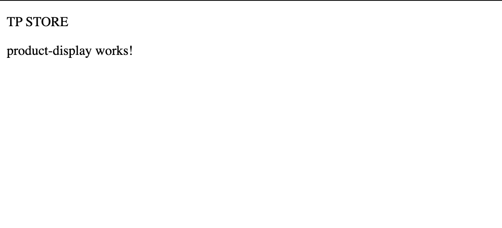
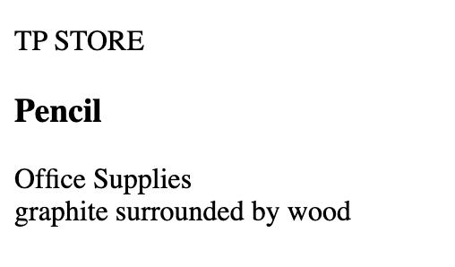

## Generating our First Component ##

Now that we have some test data to work with we can start building our application. The first thing we're going to do is create two folders in our app folder:

> components
> services

This is just to structure our project. The file structure will vary based on scale of your angular project. Navigate to your integrated terminal and run the command

* ``ng generate component components/productDisplay``

This will generate a component named product-display in your components folder. Think of components as the building blocks of a website. Each component will represent a piece of your site. In addition, components can be nested and contained within other components.

* Navigate to the all-products.component.ts file


```Typescript
import { Component, OnInit } from '@angular/core';

@Component({
  selector: 'app-product-display',
  templateUrl: './product-display.component.html',
  styleUrls: ['./product-display.component.css']
})
export class ProductDisplayComponent implements OnInit {

  constructor() { }

  ngOnInit(): void {
  }

}
```

In this file, you'll notice a few interesting things generated by angular. First of all there is a ``@Component`` decorator that contains some important information there. 

> first is the ``selector``  property, this represents the ``html tag`` to create that represents this component. 

> second is the ``templateUrl`` this connects the ``product-display.component.html`` to this component.

> third is the ``styleUrls`` just like above, this connects the css file to this component


moving in to actual component class, the ``ngOnInit`` function is imported from ``angular/core``. This is a lifecycle hook that runs after the initialization of the component object. We can write code that will set up our component before it renders in this function.

* To add our product display component to our application, lets add the  ``<app-product-display>`` tag to our ``app.component.html`` file


```html
<h1>{{title.toUpperCase()}}</h1>
<app-product-display></app-product-display>
```

* run the command ``ng serve`` to launch your web server  again and see the new changes at ``http://localhost:4200``



as you can see, theres some pregenerated text showing that ``product-display`` works. 


## Building our First Component ##

Now that we can see our new component, lets build it into something that will display our products. First off, lets bring in a product from our ``productList`` . 

* In your ``product-display.component.ts`` declare a property named ``product`` of type ``Product`` and in ``ngOnInit()`` set the property to a new Product.


```Typescript
import { Component, OnInit } from '@angular/core';
import { Product } from 'src/app/product';

@Component({
  selector: 'app-product-display',
  templateUrl: './product-display.component.html',
  styleUrls: ['./product-display.component.css']
})
export class ProductDisplayComponent implements OnInit {
  product: Product;
  constructor() { }

  ngOnInit(): void {
    this.product = {
      id: 1,
      name: "Pencil",
      price: 1.50,
      category: "Office Supplies",
      description: "graphite surrounded by wood"
    };
  }

}

```

now that our component has a product to display, lets represent it in the html. 

* Navigate to our product-display.html and build a div that represents and contains the information from the product in our typescript. We will use the same binding syntax from earlier to bind the information from our typescript to our html.

```html
<div>
    <h3>{{product.name}}</h3>
    <span>{{product.category}}</span>
    <br>
    <span>{{product.description}}</span>
</div>
```

You should now be able to see that the first item in our product list is being represented on our website.




* to make our component a little more visually obvious, lets add a background color and light styling to make our component more visually obvious.

```CSS
div {
    background-color: beige;
    width: fit-content;
    padding: 5px
}

h3 {
    margin: 5px;
}
```

One of the really nice things about Angular is that these style sheets will only affect the component they are associated with. That means these stylings we created for div will only apply to the divs inside this specific component. For global styles, you can add them in ``styles.css`` outside of the app folder.


[previous page: getting started](./gettingStarted.md) || [next:  product container component](./containerComponent.md)