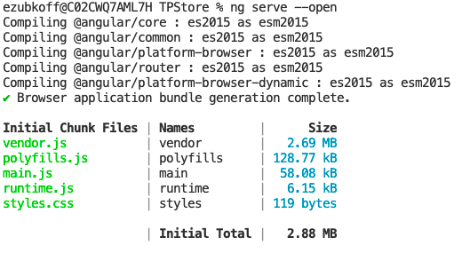
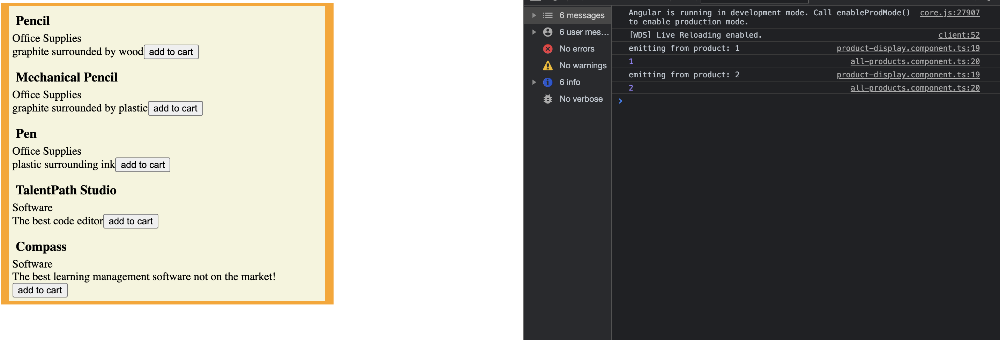
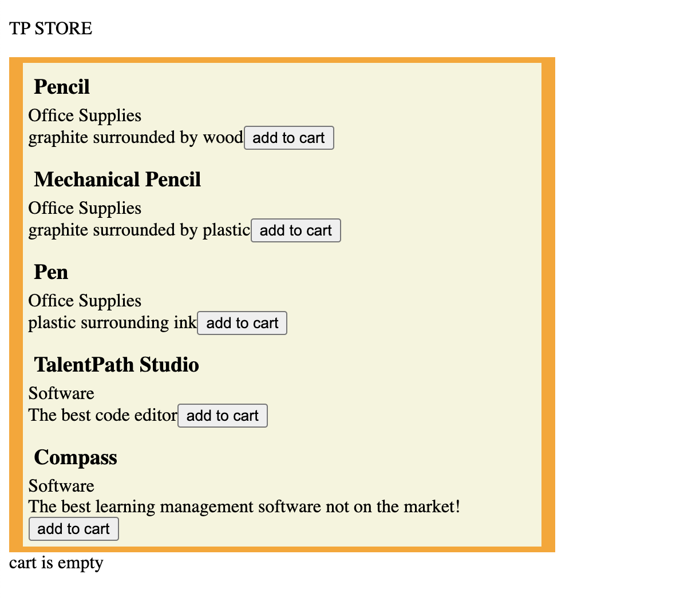
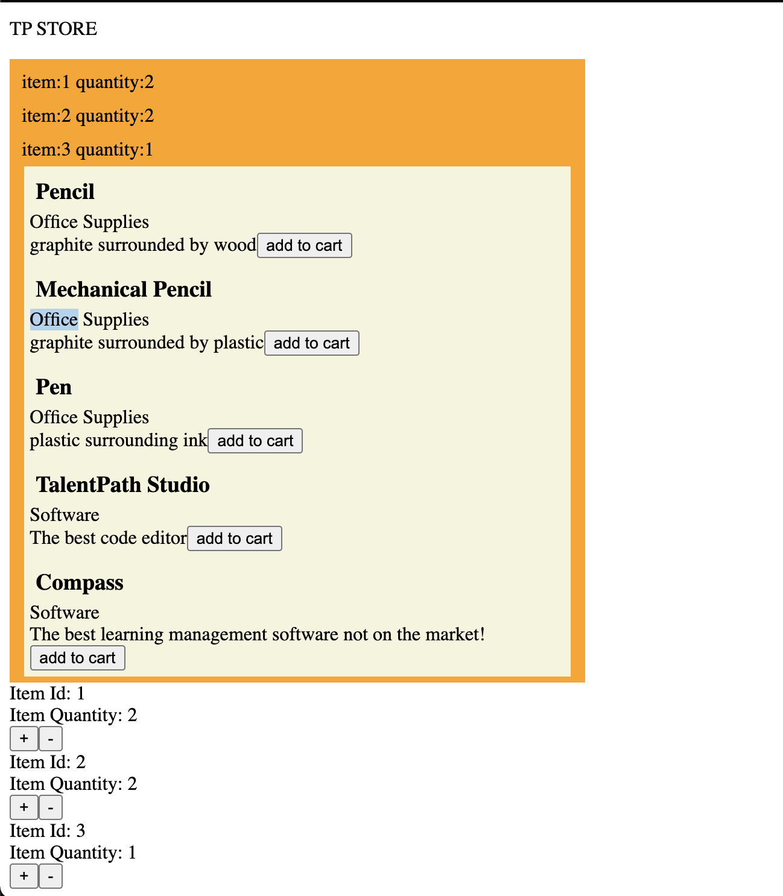
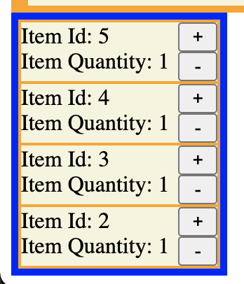
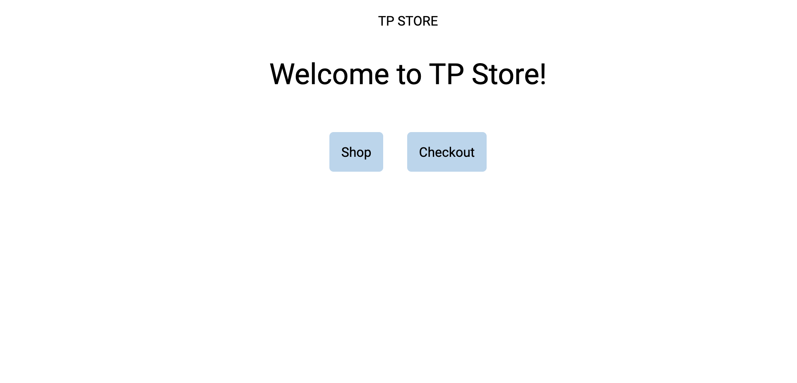
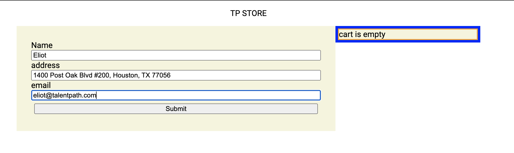

# Angular code along! #


## Installing tools ##

### Node Packet Manager ###

The first tool you will need is the Node Packet Manager (npm). 

*	download node installer [here](https://nodejs.org/en/)
*  after you install node, in your command line type
	* ``npm -v`` to make sure that node is installed
	


### Angular CLI ###

once we've successfully installed node, we can use node packet manager to install angular to our machines. In your terminal use the command 


* ``npm install -g @angular/cli``

this will install a global version of angular to your machine.

## Generating our first Angular project ##

now that we have installed Angular CLI, we can create a new project with the command

> * ``ng new code-along``

select the following settings when creating the project 


> * Strict type checking: no 
> * Add angular routing: yes
> * Stylesheet format: css

now, open the folder generated by angular in VSCode. In it there is a newly generated angular project. To run your project, in your integrated terminal enter the command at your project's root

> * ``ng serve --open``

The angular will then compile and serve up your webpage at  ``http://localhost:4200`` . The ``--open`` parameter opens up your default browser to that address. 

a full list of angular commands can be found [here](https://angular.io/cli)




After your project is being served, you'll see the the web page generated by default for an angular project 


## Exploring our Angular project ##

The default page contains some nice useful links to documentation that I will frequently refer to. That being said, for the purpose of building our application, we will be replacing this template with our own code.

> To start, navigate to ``index.html`` in the ``src`` folder

```html
<!doctype html>
<html lang="en">
<head>
  <meta charset="utf-8">
  <title>TPStore</title>
  <base href="/">
  <meta name="viewport" content="width=device-width, initial-scale=1">
  <link rel="icon" type="image/x-icon" href="favicon.ico">
</head>
<body>
  <app-root></app-root>
</body>
</html>
```

Most of this page should be rather familiar, but something that may stand out to you is the  ``app-root`` html tag. Angular uses a system of components that compartmentalizes html elements in order to allow developers to work on each piece of their application separately.

This ``<app-root>`` tag represents a selector for an angular component. Open your ``app`` folder and navigate to ``app.component.html`` 


```html
<!-- * * * * * * * * * * * * * * * * * * * * * * * * * * * * * * * -->
<!-- * * * * * * * * * * * The content below * * * * * * * * * * * -->
<!-- * * * * * * * * * * is only a placeholder * * * * * * * * * * -->
<!-- * * * * * * * * * * and can be replaced. * * * * * * * * * * * -->
<!-- * * * * * * * * * * * * * * * * * * * * * * * * * * * * * * * -->
<!-- * * * * * * * * * Delete the template below * * * * * * * * * * -->
<!-- * * * * * * * to get started with your project! * * * * * * * * -->
<!-- * * * * * * * * * * * * * * * * * * * * * * * * * * * * * * * -->

<style>
  :host {
    font-family: -apple-system, BlinkMacSystemFont, "Segoe UI", Roboto, Helvetica, Arial, sans-serif, "Apple Color Emoji", "Segoe UI Emoji", "Segoe UI Symbol";
    font-size: 14px;
    color: #333;
    box-sizing: border-box;
    -webkit-font-smoothing: antialiased;
    -moz-osx-font-smoothing: grayscale;
  }

  h1,
  h2,
  h3,
  h4,
  h5,
  h6 {
    margin: 8px 0;
  }
<!-- and more following this -->

```

The default page we served up earlier was generated by the code here. We're going to go ahead and delete all of the code angular built for us, and add our own.

After deleting the default generated code, lets add a html element to our component. 

> ``<p>My Store</p>``

You'll see that instead of the angular default page, we are given the page with our html element


something you'll notice is that within this app folder, there are quite a few different files named 
``app.component.(ts/css/html/spec.ts)``

those files correspond to the associated css and typescript files for the app component. 
**Note: we will not be touching the .spec.ts files in this tutorial, please make sure to edit only the .ts files** 

Go to the ``app.component.ts`` file.

```Typescript
import { Component } from '@angular/core';

@Component({
  selector: 'app-root',
  templateUrl: './app.component.html',
  styleUrls: ['./app.component.css']
})
export class AppComponent {
  title = 'TPStore';
}

```

change the variable named ``title`` 's value to be ``TP Store``

return to your ``index.html``. Now we're going to create a one way binding to show the data from our ``Typescript`` file.

Replace ``My Store`` with ``{{title}}``. What we're doing here is creating a binding between our typescript and html. Angular looks for the variable title and displays its interpretation within those double braces. As a result, your webpage should now look like 


Taking that a step further, angular interprets the expression within those braces as javascript. That means you can manipulate the data even further if necessary for example, in our braces we can change 
``title`` to ``title.toUpperCase()``


There are a few ways to bind data in angular to read more about this topic, you can read about binding syntax [here](https://angular.io/guide/binding-syntax)

# Store Products #

So the first thing for our store is to have products. In this demonstration we'll be storing our products in a Typescript file. Create a new file in your ``app`` folder named ``product.ts``. In here we will export a class named product. Each product will have an id, name, category and an optional description.

```Typescript
export class Product {
    id:number;
    name:string;
    price:number;
    category:string;
    description?:string;
    
}
```

In addition, we will  export an array of products to be used within our application

```Typescript
export var productList :Product[] = [
    {
        id:1,
        name:"Pencil",
        price:1.50,
        category:"Office Supplies",
        description:"graphite surrounded by wood"
    },
    {
        id:2,
        name:"Mechanical Pencil",
        price:2.00,
        category:"Office Supplies",
        description:"graphite surrounded by plastic"
    },
    {
        id:3,
        name:"Pen",
        price:2.00,
        category:"Office Supplies",
        description:"plastic surrounding ink"
    },
    {
        id:4,
        name:"TalentPath Studio",
        price:100.00,
        category:"Software",
        description:"The best code editor"
    },
    {
        id:5,
        name:"Compass",
        price:95.00,
        category:"Software",
        description:"The best learning management software not on the market!"
    }
];
```

Now that we've made some test data to develop with, we can start displaying our products in our store.


## Generating our First Component ##

Now that we have some test data to work with we can start building our application. The first thing we're going to do is create two folders in our app folder:

> components
> services

This is just to structure our project. The file structure will vary based on scale of your angular project. Navigate to your integrated terminal and run the command

* ``ng generate component components/productDisplay``

This will generate a component named product-display in your components folder. Think of components as the building blocks of a website. Each component will represent a piece of your site. In addition, components can be nested and contained within other components.

* Navigate to the all-products.component.ts file


```Typescript
import { Component, OnInit } from '@angular/core';

@Component({
  selector: 'app-product-display',
  templateUrl: './product-display.component.html',
  styleUrls: ['./product-display.component.css']
})
export class ProductDisplayComponent implements OnInit {

  constructor() { }

  ngOnInit(): void {
  }

}
```

In this file, you'll notice a few interesting things generated by angular. First of all there is a ``@Component`` decorator that contains some important information there. 

> first is the ``selector``  property, this represents the ``html tag`` to create that represents this component. 

> second is the ``templateUrl`` this connects the ``product-display.component.html`` to this component.

> third is the ``styleUrls`` just like above, this connects the css file to this component


moving in to actual component class, the ``ngOnInit`` function is imported from ``angular/core``. This is a lifecycle hook that runs after the initialization of the component object. We can write code that will set up our component before it renders in this function.

* To add our product display component to our application, lets add the  ``<app-product-display>`` tag to our ``app.component.html`` file


```html
<h1>{{title.toUpperCase()}}</h1>
<app-product-display></app-product-display>
```

* run the command ``ng serve`` to launch your web server  again and see the new changes at ``http://localhost:4200``


as you can see, theres some pregenerated text showing that ``product-display`` works. 


# Building our First Component #

Now that we can see our new component, lets build it into something that will display our products. First off, lets bring in a product from our ``productList`` . 

* In your ``product-display.component.ts`` declare a property named ``product`` of type ``Product`` and in ``ngOnInit()`` set the property to a new Product.


```Typescript
import { Component, OnInit } from '@angular/core';
import { Product } from 'src/app/product';

@Component({
  selector: 'app-product-display',
  templateUrl: './product-display.component.html',
  styleUrls: ['./product-display.component.css']
})
export class ProductDisplayComponent implements OnInit {
  product: Product;
  constructor() { }

  ngOnInit(): void {
    this.product = {
      id: 1,
      name: "Pencil",
      price: 1.50,
      category: "Office Supplies",
      description: "graphite surrounded by wood"
    };
  }

}

```

now that our component has a product to display, lets represent it in the html. 

* Navigate to our product-display.html and build a div that represents and contains the information from the product in our typescript. We will use the same binding syntax from earlier to bind the information from our typescript to our html.

```html
<div>
    <h3>{{product.name}}</h3>
    <span>{{product.category}}</span>
    <br>
    <span>{{product.description}}</span>
</div>
```

You should now be able to see that the first item in our product list is being represented on our website.


* to make our component a little more visually obvious, lets add a background color and light styling to make our component more visually obvious.

```CSS
div {
    background-color: beige;
    width: fit-content;
    padding: 5px
}

h3 {
    margin: 5px;
}
```

One of the really nice things about Angular is that these style sheets will only affect the component they are associated with. That means these stylings we created for div will only apply to the divs inside this specific component. For global styles, you can add them in ``styles.css`` outside of the app folder.


# Generating the  Container  #

Now that we've styled our individual component, we're going to programatically generate a productDisplay component for each of our products.

* In your terminal, generate a new component named all components
* ``ng generate component components/all-products``

This component will serve as a container that holds all of our individual product display components.

## Nesting Components ##
* Navigate to your ``app.component.html`` and replace the selector for the individual product display with the selector for the all products display

```html
<p>{{title.toUpperCase()}}</p>
<app-all-products></app-all-products>
```

* Navigate to your ``all-products.component.html`` and add the selector for the indivudual product display

```html
<div>
<p>all-products works!</p>
<app-product-display></app-product-display>
</div>
```

to create some visual clarity of  the component, create a div to contain the component and style it like this:

```css
div {
    background-color: orange;
    width: fit-content;
    padding: 5px;
}
```
the end result should look like this


## Get Products from our productDataSource[] ##

* navigate to all-products.component.ts
* declare a products array to store our products on the component
* in the ``ngOnInit``, set the local ``products`` array to a copy of our ``productDataSource`` 

``` Typescript
import { Component, OnInit } from '@angular/core';
import { Product, productDataSource } from 'src/app/product';

@Component({
  selector: 'app-all-products',
  templateUrl: './all-products.component.html',
  styleUrls: ['./all-products.component.css']
})
export class AllProductsComponent implements OnInit {
  products: Product[];
  constructor() { }

  ngOnInit(): void {
    this.products = [...productDataSource];
  }

}
```

Now that we have our list of products, we can use that list to generate a series of product display components with ``*ngFor``

``*ngFor`` structural directive that renders a template for each item in a collection. The directive is placed on an element, which becomes the parent of the cloned templates. 

[read more about ngFor](https://angular.io/api/common/NgForOf)

* In your ``all-products.component.html`` add the ``*ngFor`` selector to your ``app-product-display`` tag

```html
    <div>
    <p>all-products works!</p>
    <app-product-display *ngFor="let product of products"></app-product-display>
</div>
```

this will create a product display component for each item in our ``products:Product[]`` array in our typescript. 


That being said, we would like to input that product from our list into our product display component, so we will use a ``[target]="expression" `` binding syntax on our parent component, and a ``@Input()`` binding syntax on our child component to pass the data 

* in your  ``all-products.component.html`` add the binding syntax ``[product]="product"``

```html
<div>
    <p>all-products works!</p>
    <app-product-display *ngFor="let product of products" [product]="product"></app-product-display>
</div>
```

* in your ``product-display.component.ts``, add the ``@Input()`` decorator to product to finish the 1 way binding between the two components, and delete the product we created in our ``ngOnInit`` function

```Typescript
import { Component, Input, OnInit } from '@angular/core';
import { Product } from 'src/app/product';

@Component({
  selector: 'app-product-display',
  templateUrl: './product-display.component.html',
  styleUrls: ['./product-display.component.css']
})
export class ProductDisplayComponent implements OnInit {
  @Input() product: Product;
  constructor() { }

  ngOnInit(): void {

  }

}
```

Your website should now look like this:


finally, lets add a static width to the inner component to create uniformity between the components

```css
product-display.component.css
div {
    background-color: beige;
    width: 95%;
    margin-left: auto;
    margin-right: auto;
    padding: 5px;
}

h3 {
    margin: 5px;
}

all-products.component.css

```

and now your site should look like this


# Cart #
Now that we've covered inputting data from a parent component to a child component, we're going to be exploring how to pass data up from a child component to a parent component. In this example, we're going to be using outputs from our child product-display component to update our parent all-products component.

## Cart Model ##
The first thing we'll be doing is creating an interface to represent our cart. Create a new file in our app folder named cartItem.ts. We'll be defining a interface CartItem that has two properties:

`` itemId, quantity ``

```Typescript 
export interface CartItem {
    itemId:number,
    quantity:number
}
```

* Now that we have this model, in ``all-products.component.ts`` initialize a local variable ``cart`` to hold the items in our customer's cart.


```Typescript

@Component({
  selector: 'app-all-products',
  templateUrl: './all-products.component.html',
  styleUrls: ['./all-products.component.css']
})
export class AllProductsComponent implements OnInit {
  products: Product[];
  cart: CartItem[];
  constructor() { }

  ngOnInit(): void {
    this.products = [...productDataSource];
    this.cart = [];
  }

}
```

* next, we're going to create a html element to display our cart's information

```html
<div>
    <div id="cartDisplay" *ngFor="let item of cart">
        <span>item:{{item.itemId}} quantity:{{item.quantity}}</span>
    </div>
    <app-product-display *ngFor="let product of products" [product]="product"></app-product-display>
</div>
```

Now that we have our setup for the cart we can dive into emitting data from our child components.


## Creating a Custom Emitter ##

* Navigate to the ``product-display.component.html``
* Create a button element as shown below

```html
<div>
    <h3>{{product.name}}</h3>
    <span>{{product.category}}</span>
    <br>
    <span>{{product.description}}</span>
    <button (click)="addToCart()">add to cart</button>
</div>
```

You'll notice a new bit of syntax. the parenthesis on ``(click)`` represents a binding syntax that will bind the click event of the button to an expression from our typescript. In this case, that expression will be a function called ``addToCart``

* navigate to ``product-display.component.ts`` and add a new Event Emitter as a property with the annotation ``@Output()``

```Typescript
export class ProductDisplayComponent implements OnInit {
  @Input() product: Product;
  @Output() cartEmitter: EventEmitter<any> = new EventEmitter();
  constructor() { }

  ngOnInit(): void {

  }

}
```

this Event Emitter will the be the property that outputs up to our parent component to add items to our cart. 

* Create the method AddToCart() that will use the emitter to emit data about what item to add to our cart.

```Typescript
xport class ProductDisplayComponent implements OnInit {
  @Input() product: Product;
  @Output() cartEmitter: EventEmitter<any> = new EventEmitter();
  constructor() { }

  ngOnInit(): void {

  }
  addToCart():void {
    console.log('emitting from product: '+this.product.id)
    this.cartEmitter.emit(this.product.id);
  }

}
```
Now that we're able to emit from the child component, we have to listen for the event in our parent component.

* Navigate to ``all-products.component.html``
* add the following to our ``<app-product-display>`` component:
    * ``(cartEmitter)="addToCart($event)" ``

```html
<div>
    <div id="cartDisplay" *ngFor="let item of cart">
        <span>item:{{item.itemId}} quantity:{{item.quantity}}</span>
    </div>
    <app-product-display (cartEmitter)="addToCart($event)" *ngFor="let product of products" [product]="product"></app-product-display>
</div>
```

This creates a listener for the cartEmitter event and will pass the ``$event`` to the ``addToCart`` function on our parent component.

* Lets create a function in ``all-products.component.ts`` to capture that data and update our cart.
* first, lets console.log the event to get an idea of whats stored in this event


```Typescript
  addToCart(id):void {
    console.log(id);
  }
```



As you can see, we have visible console logs from both of our methods.
Now, lets add functionality that creates a cart item and adds that increments the quantity if the item exists or creates and adds the CartItem to our cart.

```Typescript
  addToCart(id):void {
    console.log(id);
    let toAdd = this.cart.find(item => item.itemId === id);
    if(toAdd) toAdd.quantity++;
    else this.cart.push({itemId:id, quantity:1})
  }
```

Now, pressing the add to cart button on our website should add entries at the top of our all-product's component with the item id and quantity.


# Cart Service #
In this section, we will be introducing services to our application. Services follow a singleton pattern and are accessible throughout your application. They can serve as a hub for your code to interact with other components, as well as allow you to re-use useful functions.

## Creating a Cart Service ##
Previously, we were storing our cart on a property in the  ``AllProductsComponent`` in ``all-products.component.ts``. The issue with that is our cart data might be important in other sections of our application. In this example we will create a seperate, unlinked component that will pull data from our cart service.

* To create a service, in your integrated terminal run the following command
    * ``ng generate service services/cart``
* In addition, we will create a component named ``cart`` that displays the cart in our components folder
    * ``ng generate component components/cart``
* Navigate to your newly generated ``cart.service.ts``


```Typescript
import { Injectable } from '@angular/core';

@Injectable({
  providedIn: 'root'
})
export class CartService {

  constructor() { }
}

```

Lets go ahead and add some relevant data that will make this service useful.
* create a property named ``cart`` that holds an array of ``CartItem``
* additionally, add an ``addItem()`` function and a ``removeItem()`` function
* finally add a ``getCart()`` function that other components can use to get the cart from the ``cart service ``


```Typescript 

import { Injectable } from '@angular/core';
import { CartItem } from '../cartItem';

@Injectable({
  providedIn: 'root'
})
export class CartService {
  cart : CartItem[] = [];
  constructor() { }
  addToCart(id:number):void {
    let toAdd = this.cart.find(item => item.itemId === id);
    if(toAdd) toAdd.quantity++;
    else this.cart.push({itemId:id, quantity:1})
  }
  removeItem(id:number): void{
    let toRemove = this.cart.find(item => item.itemId === id);
    if(!toRemove) return;
    if(toRemove.quantity <2) this.cart.splice(this.cart.indexOf(toRemove),1);
    else toRemove.quantity--;
  }
  getCart():CartItem[]{
      return this.cart;
  }
}
```

* Now, lets navigate to our ``all-products.component.ts``

We can inject our service into other components by including the service in the constructor for the component class

```Typescript
constructor(private cartService: CartService) { }
```

Now that we have access to our Cart Service, lets refactor our AllProductsComponent to make use of the Cart Service

* In our ngOnInit() instead of initializing a new array for cart, we'll get a reference to the ``cart`` array that lives in our Cart Service
    * Since the cart is an array, the values within the array will updates globally when we access our cart in this fashion.

```Typescript
  ngOnInit(): void {
    this.products = [...productDataSource];
    this.cart = this.cartService.getCart();
  }
```

* Additionally, lets refactor our ``addToCart()`` to make use of the method avaliable to us in the cart service

```Typescript
  addToCart(id:number):void {
    this.cartService.addToCart(id);
  }
```


* Take a moment to play with your website. You'll realize that despite refactoring the component to make use of a cart in the Cart Service, the same functionality still remains. You'll see the same cart display functions working on our all-products component.


## Creating a Cart Display Component ##


* Navigate to our ``app.component.html`` and add the selector for our ``cart.component.html``
    * ``<app-cart>``

```html
<p>{{title.toUpperCase()}}</p>
<app-all-products></app-all-products>
<app-cart></app-cart>
```
* Next, navigate to ``cart.component.html`` and add the following code

```html
<div class="container">
    <div class="cartItem" *ngFor="let cartItem of cart">
        <div class="itemInfo">
            <span class="itemId">Item Id: {{cartItem.itemId}}</span>
            <br>
            <span class="itemQuantity">Quantity: {{cartItem.quantity}}</span>
        </div>
        <div class="buttons">
            <button class="add" (click)="addToCart(cartItem)">+</button>
            <button class="remove" (click)="removeFromCart(cartItem)">-</button>
        </div>
    </div>
    <div *ngIf="cart.length === 0" class="cartItem">
        <span>cart is empty</span>
    </div>
</div>
```

* Next lets add the Typescript for the component, add the ``CartService`` for the component, then pull in the ``cart`` in the ``ngOnInit()`` function


```Typescript 
export class CartComponent implements OnInit {
  cart: CartItem[];
  constructor(private cartService: CartService) { }

  ngOnInit(): void {
    this.cart=this.cartService.getCart();
  }

}
```

You should now see the component at the bottom of of our page, and it will update with items as you press the "add to cart" buttons on each product.



* Next, lets add functionality to the ``+`` and ``-`` buttons
    * Make use of your Cart Service's functions to add and remove items from the cart


```Typescript 
export class CartComponent implements OnInit {
  cart: CartItem[];
  constructor(private cartService: CartService) { }

  ngOnInit(): void {
    this.cart=this.cartService.getCart();
  }
  addToCart(cartItem:CartItem): void {
    this.cartService.addToCart(cartItem.itemId);
  }
  removeFromCart(cartItem:CartItem): void {
    this.cartService.removeItem(cartItem.itemId);
  }

}
```

Now, clicking the ``+`` or ``-`` buttons will increment or decrement the amount of the item in your cart. Something to note is that since both the cart on the ``all-products.component.ts`` and the ``cart.component.ts`` share the same object, they both update whenever any changes are made to the cart



Finally, lets add some styling to the component to make each item visually clearer.


```css
.container {
    border: blue 5px solid;
    width:20%;
    background-color: orange;
}

.cartItem {
    background-color: beige;
    margin: 2px;
}

.itemInfo {
    display: inline-flex;
    flex-direction: column;
    justify-content: space-around;
    width: 80%;
}

.buttons {
    width: 20%;
    display: inline-flex;
    flex-direction: column;
    justify-content: space-around;
}
```



In the CSS here, I use CSS Flexbox to designate the ``itemInfo`` and ``buttons`` div as inline flex containers. Since they become flex containers, I can use ``flex-direction`` to align the items inside vertically with space around. 

I highly recommend learning more css flexbox [here](https://css-tricks.com/snippets/css/a-guide-to-flexbox/)

## Some more styling ##

Using the same methodology, lets align the 2 major components we created in a column format. Navigate to your ``app.component.html`` add classes to each component, as well as create a div that holds the page content.

```html
<div class="title">
    <p>{{title.toUpperCase()}}</p>
</div>
<div class="page">
    <app-all-products class="products"></app-all-products>
    <app-cart class="cart"></app-cart>
</div>
```

We'll add in the following css in order to create a 2 column page layout making use of the same flexbox concepts discussed earlier

```css
.title {
    display: block;
    margin-left: auto;
    margin-right: auto;
    width: fit-content;
}

.products {
    display: inline-block;
    width: 50%;
}

.cart {
    display: inline-block;
    width: 20%;
}

.page {
    width: 80vw;
    margin-left: auto;
    margin-right: auto;
    display: flex;
    justify-content: center;
}
```

```
//cart.component.css
.container {
    border: blue 5px solid;
    //remove width requirements here
    background-color: orange;
}
```

One thing to note is that since the cart changes from a block level element to an inline-block, we'll move the width styling to the outside of the component.

In this case, I set the page container become a block level flex container that hold the 2 components centered and sized according to their width.


Finally, since we have a dedicated cart component, 
* clean up the all-products component by removing the cart information

```html
<div>
    <app-product-display (cartEmitter)="addToCart($event)" *ngFor="let product of products" [product]="product"></app-product-display>
</div>
```
```Typescript 
export class AllProductsComponent implements OnInit {
  products: Product[];
  
  constructor(private cartService: CartService) { }

  ngOnInit(): void {
    this.products = [...productDataSource];
    
  }
  addToCart(id:number):void {
    this.cartService.addToCart(id);
  }


}
```

finally, we're left with a page that looks like this:


# Product Service #

Currently, we have a list of products living in an array in our product.ts file. In most applications, that data will come from the outside world. Although we will not be getting data from the outside world, we're going to refactoring our application to work as if we were getting it from outside sources. Additionally, there will be examples of how to properly communicate with a REST api in order to get data from the outside world.

## Creating our Service ##

* Generate a product service with the command ``ng generate service services/product`` 
* Bring in a copy of our productDataSource array and store it as a property the data in the service
* add a useful methods to map the ID's from a CartItem to a Product

```Typescript
getProductFromId(id:number){
  return this.products.find( product => product.id===id);
}
```

* Edit the cart component to make use of the this method in order to display a name instead of a cartItemId

```Typescript
constructor(private cartService: CartService, private productService: ProductService) { }
getProductName(cartItem:CartItem): string {
return this.productService.getProductFromId(cartItem.itemId).name;
}
```

```html
<div class="container">
    <div class="cartItem" *ngFor="let cartItem of cart">
        <div class="itemInfo">
            <span class="itemId">{{getProductName(cartItem)}}</span>

            <span class="itemQuantity">Item Quantity: {{cartItem.quantity}}</span>
        </div>
        <div class="buttons">
            <button class="add" (click)="addToCart(cartItem)">+</button>
            <button class="remove" (click)="removeFromCart(cartItem)">-</button>
        </div>

    </div>
    <div *ngIf="cart.length === 0" class="cartItem">
        <span>cart is empty</span>
    </div>
</div>
```


## Making Http Requests ##

Add the HttpClientModule to your ``app.module.ts``
```Typescript
import { NgModule } from '@angular/core';
import { BrowserModule } from '@angular/platform-browser';
import { HttpClientModule } from '@angular/common/http'
import { AppRoutingModule } from './app-routing.module';
import { AppComponent } from './app.component';
import { AllProductsComponent } from './components/all-products/all-products.component';
import { ProductDisplayComponent } from './components/product-display/product-display.component';
import { CartComponent } from './components/cart/cart.component';

@NgModule({
  declarations: [
    AppComponent,
    AllProductsComponent,
    ProductDisplayComponent,
    CartComponent
  ],
  imports: [
    BrowserModule,
    AppRoutingModule,
    HttpClientModule
  ],
  providers: [],
  bootstrap: [AppComponent]
})
export class AppModule { }
```


* Navigate back to your ``product.service.ts``
* Add HttpClient to your service and create httpOptions for your request as shown below

```Typescript
export class ProductService {
products: Product[] = [...productDataSource]
httpOptions = {headers: new HttpHeaders({ 'Content-Type': 'application/json' })}

constructor(private http: HttpClient) { }
}
```


HttpClient is a library in angular that offers a full suite of http request functionality similar to Ajax or Axios.

[read more about http client here](https://angular.io/api/common/http/HttpClient)

* To implement a GET request, implement we can use a setup similar to this:

```Typescript
import { Injectable } from '@angular/core';
import { HttpClient, HttpHeaders } from '@angular/common/http'
import { Product, productDataSource } from '../product';
import { Observable, of } from 'rxjs';
import { catchError, tap } from 'rxjs/operators'

@Injectable({
  providedIn: 'root'
})
export class ProductService {
products: Product[] = [...productDataSource]
httpOptions = {headers: new HttpHeaders({ 'Content-Type': 'application/json' })}

constructor(private http: HttpClient) { }

getProducts(): Observable<Product[]> {
  let observableToReturn: Observable<any> = this.http.get('http://fakeurl:NOTAREALPORT/api/endpoint', this.httpOptions).pipe(
    tap(_ => console.log('images successfully retrieved')),
   
  )
  return observableToReturn;
  }
}
```

To explain whats going on in this method, we use Angular's HttpClient to make a get request. HttpClient's method returns an Observable which is similar to a Promise. The key difference between an Observable and Promises are that Observables are lazilly loaded. This means that the Observable tries to have the data ready from the get request at the time when the .subscribe() method is called.

** IMPORTANT NOTE: If an Observable is never subscribed to, the http request will never take place ** 
[read more about observables here](https://angular.io/guide/observables)

* For the purposes of this tutorial, instead of returning an observable with no data, we'll be returning on observable created with the ``of()`` method from ``rxjs/operators``

```Typescript
return of(this.products);
```


## Handling Observables ##
Now that this method returns an observable we can look into how to handle the observable in our ``all-products.component.ts``

* Replace getting the data directly from the source in the ``ngOnInit()``and instead get that data as an observable from our ``Product Service``

```Typescript
export class AllProductsComponent implements OnInit {

  products: Product[];
  
  constructor(private cartService: CartService, private productService: ProductService) { }

  ngOnInit(): void {
    //replaced
    let prodObservable = this.productService.getProducts();
  }
  addToCart(id:number):void {
    this.cartService.addToCart(id);
  }
}
```

to access the data from that observable, call the ``.subscribe()`` method

```Typescript
prodObservable.subscribe(data => this.products = data);
```

Something else important to note about Observables is their asynchronous nature. That means that we are not guarunteed  that  the data from the subscribe method is provided at any time outside of the subscribe method.

Although not much has changed visually here, I do want to show that the site remains fully functional even when serving asynchronous data.

[read more about asynchronous programming](https://developer.mozilla.org/en-US/docs/Learn/JavaScript/Asynchronous)


# Introduction #

Up until this point, most of the instruction in this code along has been focused towards making individual parts of our website to work. In this section, we'll be taking a step back and focusing on the "bigger picture" of building a website

One of the main ways we are able to architect out our pages is through angular's ``routing``. This will let us make use of the website url and alter what shows up on our page at different times. Something to note is that navigating through the url bar on your browser will restart your application and lose data in your browser's ``localStorage``. If you want data to persist, it will have to be stored in ``sessionStorage`` or ``cookies``. This will come in to play with our cart's ability to persist.

## Refactoring from Components to Pages ##

* in your components folder, add a folder named ``pages`` and generate a ``shop``,``checkout``, and ``home`` components into that folder.


* in your ``app.component.ts`` take the content that was contained within the ``page`` div and add it to the ``shop`` page, dont forget to take the css as well!
* add in a ``<router-outlet>`` tag to replace the page you just made.
    * this tag represents other components, depending on the url provided. We'll see how to use this shortly.

```html
<div class="title">
    <p>{{title.toUpperCase()}}</p>
</div>
<router-outlet></router-outlet>
```

## Adding Routing ##
* Navigate to ``app-routing.module.ts``

In this file, you'll see a const variable ``routes`` of type ``Routes[]``. This is where we will store all the url paths for our application. Each Route will have a ``path`` and a ``component``

* Add the following routes as shown:

```Typescript
import { NgModule } from '@angular/core';
import { RouterModule, Routes } from '@angular/router';
import { CheckoutComponent } from './components/pages/checkout/checkout.component';
import { HomeComponent } from './components/pages/home/home.component';
import { ShopComponent } from './components/pages/shop/shop.component';

const routes: Routes = [{path:'',component:HomeComponent},
                        {path:'/shop', component:ShopComponent},
                        {path:'/checkout', component:CheckoutComponent}
                ];

@NgModule({
  imports: [RouterModule.forRoot(routes)],
  exports: [RouterModule]
})
export class AppRoutingModule { }
```

* Now navigate to your website. You'll see that instead of the page we had built, ``localhost:4200`` navigates to a page that has the default text for the ``home component``


* Navigate to ``localhost:4200/shop`` and you'll see that the page we made earlier now lives at that route.


## Creating Other Pages ##

In the next section, I'll be going quickly through creating the pages for the other routes that we created in the routing component. Most of the content was covered in earlier parts of the code-along, and I'll only be covering key points. If you would like, go ahead and create the pages yourself and then check back with my examples. Here are the requirements for the ``Home`` page and the ``Checkout`` page

* Home Page
  * navigation to the other pages
  * a welcome message
* Checkout page
  * cart information about purchase
  * subtotal
  * fields that take customer information
  * non-implemented button to let customers purchase their products

The only truly new material to learn is how to use ``routerLink`` in angular which you can read more about [here](https://angular.io/api/router/RouterLink)


## Home Page ##
``html``
```html
<div class="welcome">
    <p>Welcome to TP Store!</p>
</div>
<div class="navigation">
    <div class="nav" routerLink="/shop">Shop</div>
    <div class="nav" routerLink="/checkout">Checkout</div>
</div>
```
``css``
```css
.nav {
    text-align: center;
    margin: 1%;
    background-color: rgb(183, 213, 238);
    padding: 1%;
    border-radius: 5px;
}

.navigation {
    display: flex;
    justify-content: center;
}

.welcome {
    text-align: center;
}

p {
    font-size: 35px;
}
```


Here is a simple home page for the user to navigate to. It contains navigation and a welcome message for the user. As mentioned earlier, we use ``routerLink`` as a property in order to have that DOM element serve as a link to another page. Note that this can be placed on any number of DOM elements, not just a ``div``

## Checkout Page ##

```html
<div class="page">
    <div class="info">
        <label for="">Name</label>
        <input #name type="text">
        <label for="">address</label>
        <input #address type="text">
        <label for="">email</label>
        <input #email type="email">
        <button (click)="submit(name.value,address.value,email.value)">Submit</button>
    </div>
    <div class="cart">
        <app-cart></app-cart>
    </div>
</div>
```
```css
.page {
    display: inline-flex;
    width: 100vw;
    justify-content: center;
}

.info {
    width: 50%;
    display: flex;
    flex-direction: column;
    padding: 2%;
    justify-content: space-around;
}

.cart {
    width: 20%
}

button {
    margin: 1%;
}


.info {
    background-color: beige;
    width: 40%;
}
```


Here is a sample checkout page. Something new in this page would be the ``#name`` syntax on the text inputs. This is an angular syntax that allows you to use the name following the ``#`` symbol to identify DOM elements. As you can see as well, we are reusing our cart component to allow users to look  at the items while checking out. 


## Site Navigation ##

Lastly, we'll add a global navigation bar so that our users can navigate to other pages from any page, not just the home page. As you've seen with our ``TP STORE`` title, components and dom elements outside the ``<router-outlet>`` will remain even when changing pages.

* Navigate to app.component.html
* add the navigation div

```html
<div class="title" routerLink="">
    <p>{{title.toUpperCase()}}</p>
</div>
<div class="navigation">
    <span class="nav" routerLink="">Home</span>
    <span class="nav" routerLink="shop">Shop</span>
    <span class="nav" routerLink="checkout">Checkout</span>
</div>
<router-outlet></router-outlet>
```
```css
.navigation {
    display: flex;
    justify-content: space-between;
    width: 50%;
    margin-left: auto;
    margin-right: auto;
    margin-top: 2%;
    margin-bottom: 2%;
    border: 5px rgb(105, 105, 82) solid;
    padding: 1%;
}

.nav {
    font-size: 20px;
    padding: 5px;
    background-color: aqua;
}
```


Now we have a global navigation bar that will remain on all of our other pages. We used the same flexbox concepts that you've been seeing throughout this tutorial to align the ``nav`` elements.


