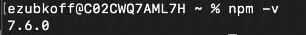
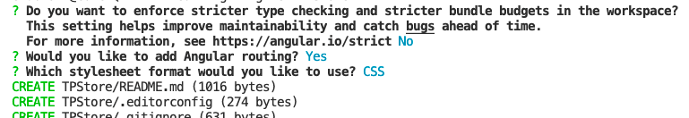
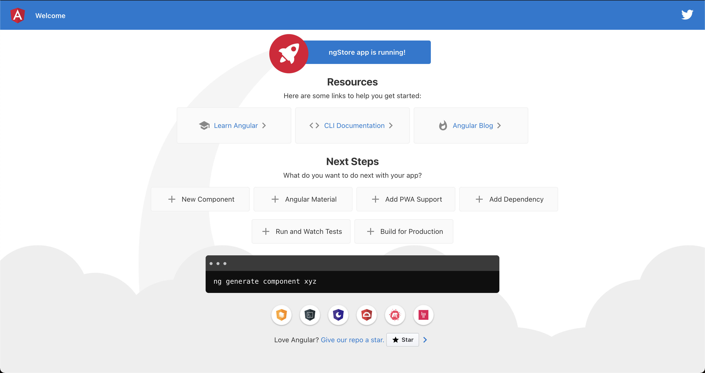
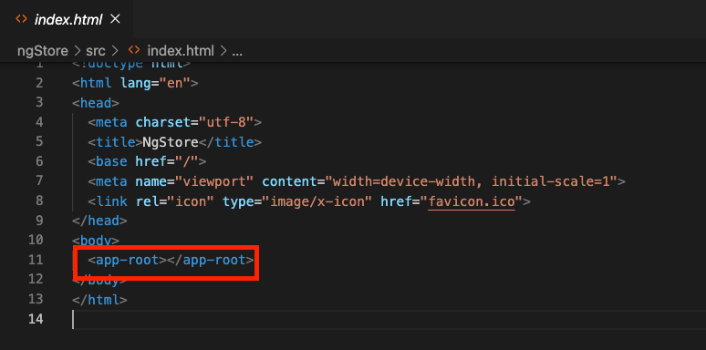
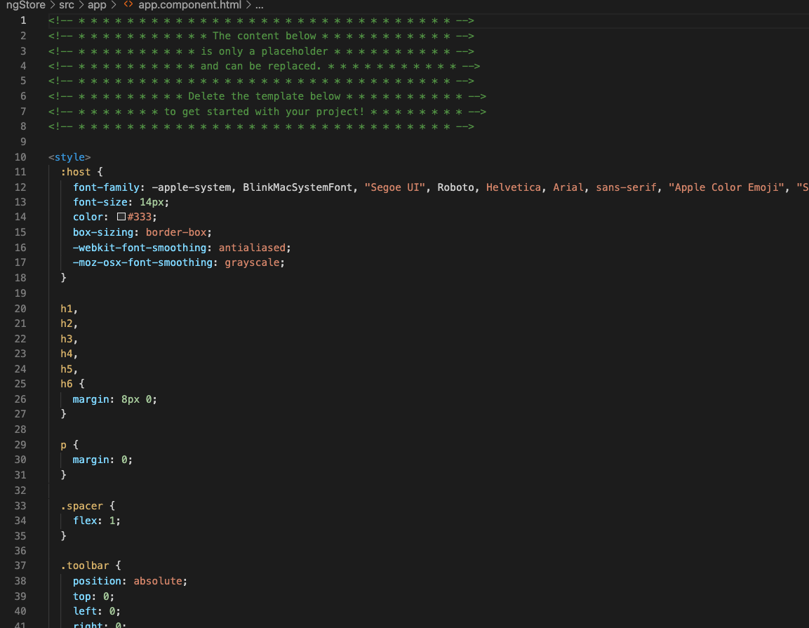
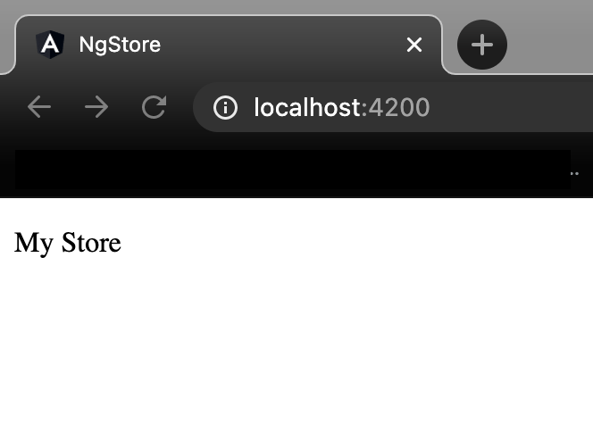

# Angular code along! #

## Installing tools ##

### Node Packet Manager ###

The first tool you will need is the Node Packet Manager (npm). 

*	download node installer [here](https://nodejs.org/en/)
*  after you install node, in your command line type
	* ``npm -v`` to make sure that node is installed
	

### Angular CLI ###

once we've successfully installed node, we can use node packet manager to install angular to our machines. In your terminal use the command 

* ``npm install -g @angular/cli``

this will install a global version of angular to your machine.

## Generating our first Angular project ##

now that we have installed Angular CLI, we can create a new project with the command

> * ``ng new code-along``

select the following settings when creating the project 

> * Strict type checking: no 
> * Add angular routing: yes
> * Stylesheet format: css

now, open the folder generated by angular in VSCode. In it there is a newly generated angular project. To run your project, in your integrated terminal enter the command at your project's root

> * ``ng serve --open``

The angular will then compile and serve up your webpage at  ``http://localhost:4200`` . The ``--open`` parameter opens up your default browser to that address. 

a full list of angular commands can be found [here](https://angular.io/cli)

After your project is being served, you'll see the the web page generated by default for an angular project 

## Exploring our Angular project ##

The default page contains some nice useful links to documentation that I will frequently refer to. That being said, for the purpose of building our application, we will be replacing this template with our own code.

> To start, navigate to ``index.html`` in the ``src`` folder

Most of this page should be rather familiar, but something that may stand out to you is the  ``app-root`` html tag. Angular uses a system of components that compartmentalizes html elements in order to allow developers to work on each piece of their application separately.

This ``<app-root>`` tag represents a selector for an angular component. Open your ``app`` folder and navigate to ``app.component.html`` 

The default page we served up earlier was generated by the code here. We're going to go ahead and delete all of the code angular built for us, and add our own.

After deleting the default generated code, lets add a html element to our component. 

> ``
My Store
``

You'll see that instead of the angular default page, we are given the page with our html element

something you'll notice is that within this app folder, there are quite a few different files named 
``app.component.(ts/css/html/spec.ts)``

those files correspond to the associated css and typescript files for the app component. 
**Note: we will not be touching the .spec.ts files in this tutorial, please make sure to edit only the .ts files** 

Go to the ``app.component.ts`` file.

change the variable named ``title`` 's value to be ``TP Store``

return to your ``index.html``. Now we're going to create a one way binding to show the data from our ``Typescript`` file.

Replace ``My Store`` with ``{{title}}``. What we're doing here is creating a binding between our typescript and html. Angular looks for the variable title and displays its interpretation within those double braces. As a result, your webpage should now look like 

Taking that a step further, angular interprets the expression within those braces as javascript. That means you can manipulate the data even further if necessary for example, in our braces we can change 
``title`` to ``title.toUpperCase()``

There are a few ways to bind data in angular to read more about this topic, you can read about binding syntax [here](https://angular.io/guide/binding-syntax)

[move on to building our store](./buildingStore.md)

