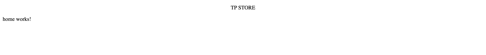
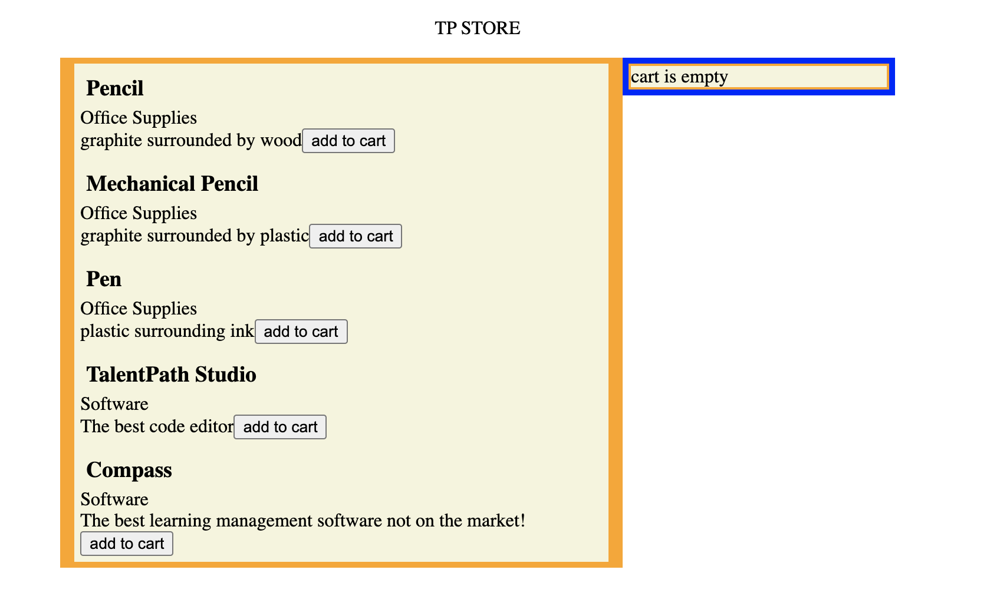
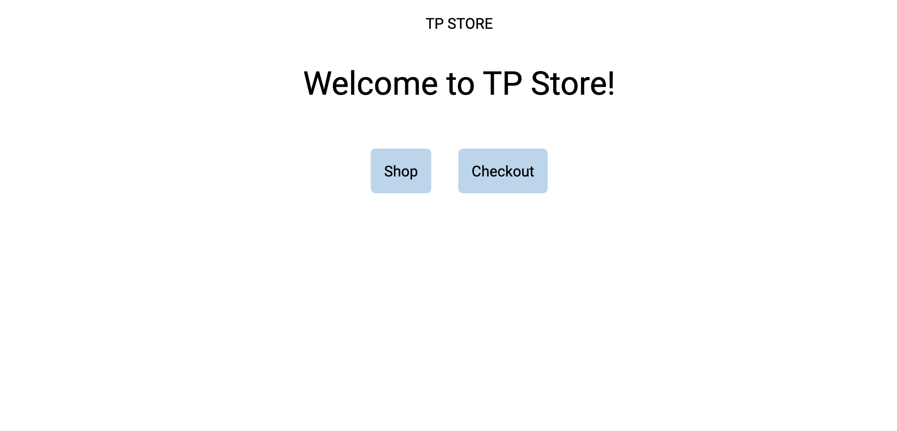
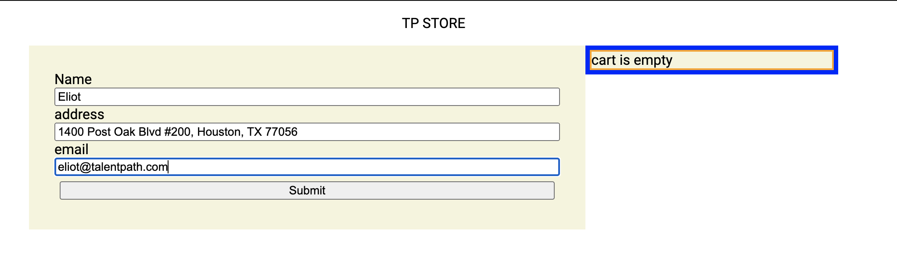
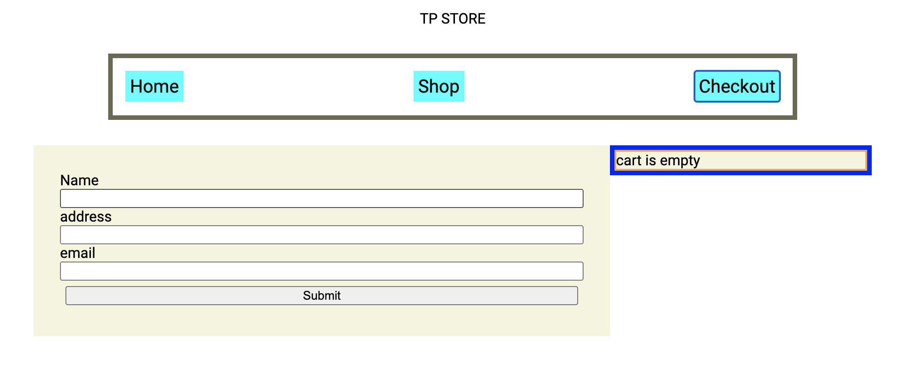

## Introduction ##

Up until this point, most of the instruction in this code along has been focused towards making individual parts of our website to work. In this section, we'll be taking a step back and focusing on the "bigger picture" of building a website

One of the main ways we are able to architect out our pages is through angular's ``routing``. This will let us make use of the website url and alter what shows up on our page at different times. Something to note is that navigating through the url bar on your browser will restart your application and lose data in your browser's ``localStorage``. If you want data to persist, it will have to be stored in ``sessionStorage`` or ``cookies``. This will come in to play with our cart's ability to persist.

## Refactoring from Components to Pages ##

* in your components folder, add a folder named ``pages`` and generate a ``shop``,``checkout``, and ``home`` components into that folder.


* in your ``app.component.ts`` take the content that was contained within the ``page`` div and add it to the ``shop`` page, dont forget to take the css as well!
* add in a ``<router-outlet>`` tag to replace the page you just made.
    * this tag represents other components, depending on the url provided. We'll see how to use this shortly.

```html
<div class="title">
    <p>{{title.toUpperCase()}}</p>
</div>
<router-outlet></router-outlet>
```

## Adding Routing ##
* Navigate to ``app-routing.module.ts``

In this file, you'll see a const variable ``routes`` of type ``Routes[]``. This is where we will store all the url paths for our application. Each Route will have a ``path`` and a ``component``

* Add the following routes as shown:

```Typescript
import { NgModule } from '@angular/core';
import { RouterModule, Routes } from '@angular/router';
import { CheckoutComponent } from './components/pages/checkout/checkout.component';
import { HomeComponent } from './components/pages/home/home.component';
import { ShopComponent } from './components/pages/shop/shop.component';

const routes: Routes = [{path:'',component:HomeComponent},
                        {path:'/shop', component:ShopComponent},
                        {path:'/checkout', component:CheckoutComponent}
                ];

@NgModule({
  imports: [RouterModule.forRoot(routes)],
  exports: [RouterModule]
})
export class AppRoutingModule { }
```

* Now navigate to your website. You'll see that instead of the page we had built, ``localhost:4200`` navigates to a page that has the default text for the ``home component``



* Navigate to ``localhost:4200/shop`` and you'll see that the page we made earlier now lives at that route.




## Creating Other Pages ##

In the next section, I'll be going quickly through creating the pages for the other routes that we created in the routing component. Most of the content was covered in earlier parts of the code-along, and I'll only be covering key points. If you would like, go ahead and create the pages yourself and then check back with my examples. Here are the requirements for the ``Home`` page and the ``Checkout`` page

* Home Page
  * navigation to the other pages
  * a welcome message
* Checkout page
  * cart information about purchase
  * subtotal
  * fields that take customer information
  * non-implemented button to let customers purchase their products

The only truly new material to learn is how to use ``routerLink`` in angular which you can read more about [here](https://angular.io/api/router/RouterLink)


## Home Page ##
``html``
```html
<div class="welcome">
    <p>Welcome to TP Store!</p>
</div>
<div class="navigation">
    <div class="nav" routerLink="/shop">Shop</div>
    <div class="nav" routerLink="/checkout">Checkout</div>
</div>
```
``css``
```css
.nav {
    text-align: center;
    margin: 1%;
    background-color: rgb(183, 213, 238);
    padding: 1%;
    border-radius: 5px;
}

.navigation {
    display: flex;
    justify-content: center;
}

.welcome {
    text-align: center;
}

p {
    font-size: 35px;
}
```


Here is a simple home page for the user to navigate to. It contains navigation and a welcome message for the user. As mentioned earlier, we use ``routerLink`` as a property in order to have that DOM element serve as a link to another page. Note that this can be placed on any number of DOM elements, not just a ``div``

## Checkout Page ##

```html
<div class="page">
    <div class="info">
        <label for="">Name</label>
        <input #name type="text">
        <label for="">address</label>
        <input #address type="text">
        <label for="">email</label>
        <input #email type="email">
        <button (click)="submit(name.value,address.value,email.value)">Submit</button>
    </div>
    <div class="cart">
        <app-cart></app-cart>
    </div>
</div>
```
```css
.page {
    display: inline-flex;
    width: 100vw;
    justify-content: center;
}

.info {
    width: 50%;
    display: flex;
    flex-direction: column;
    padding: 2%;
    justify-content: space-around;
}

.cart {
    width: 20%
}

button {
    margin: 1%;
}


.info {
    background-color: beige;
    width: 40%;
}
```


Here is a sample checkout page. Something new in this page would be the ``#name`` syntax on the text inputs. This is an angular syntax that allows you to use the name following the ``#`` symbol to identify DOM elements. As you can see as well, we are reusing our cart component to allow users to look  at the items while checking out. 


## Site Navigation ##

Lastly, we'll add a global navigation bar so that our users can navigate to other pages from any page, not just the home page. As you've seen with our ``TP STORE`` title, components and dom elements outside the ``<router-outlet>`` will remain even when changing pages.

* Navigate to app.component.html
* add the navigation div

```html
<div class="title" routerLink="">
    <p>{{title.toUpperCase()}}</p>
</div>
<div class="navigation">
    <span class="nav" routerLink="">Home</span>
    <span class="nav" routerLink="shop">Shop</span>
    <span class="nav" routerLink="checkout">Checkout</span>
</div>
<router-outlet></router-outlet>
```
```css
.navigation {
    display: flex;
    justify-content: space-between;
    width: 50%;
    margin-left: auto;
    margin-right: auto;
    margin-top: 2%;
    margin-bottom: 2%;
    border: 5px rgb(105, 105, 82) solid;
    padding: 1%;
}

.nav {
    font-size: 20px;
    padding: 5px;
    background-color: aqua;
}
```



Now we have a global navigation bar that will remain on all of our other pages. We used the same flexbox concepts that you've been seeing throughout this tutorial to align the ``nav`` elements.

