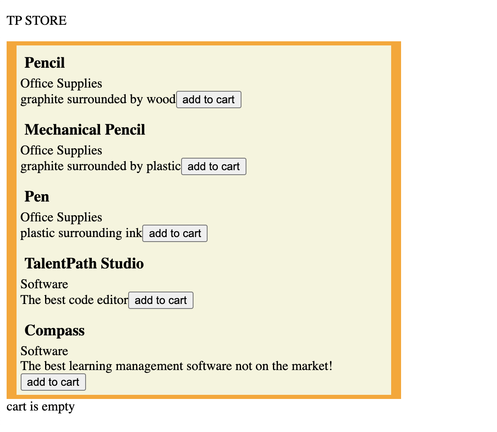
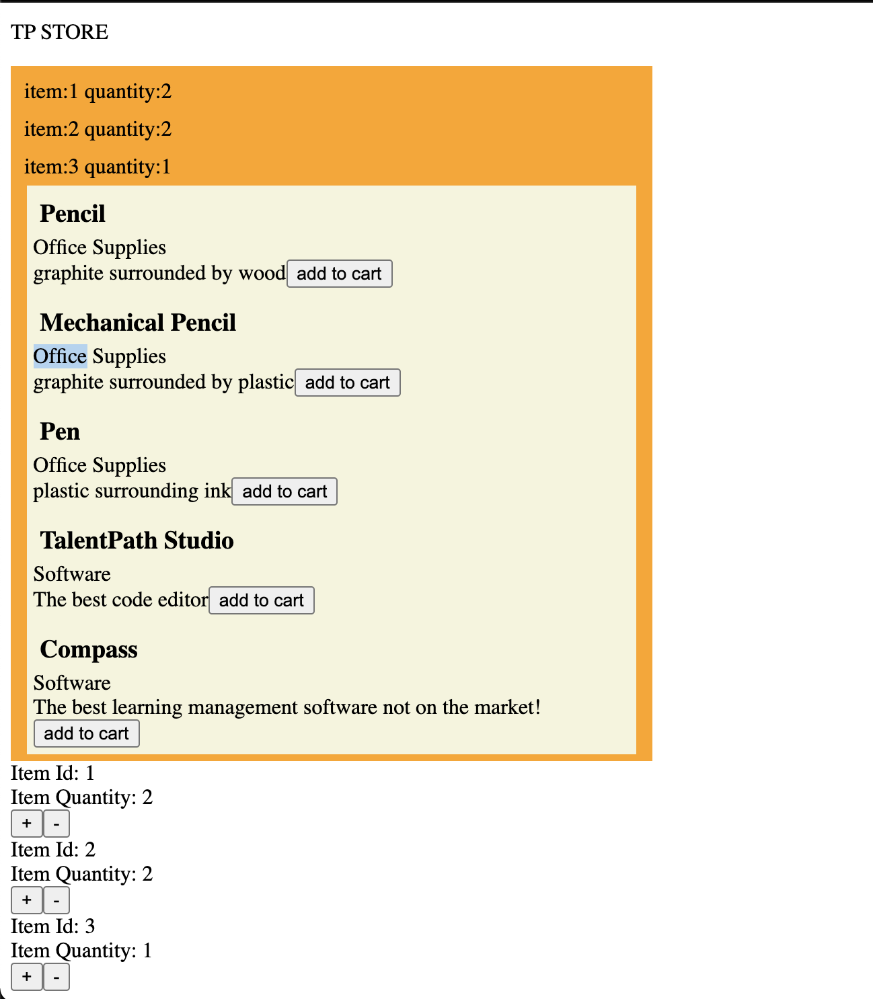
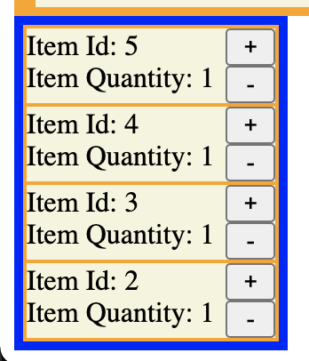
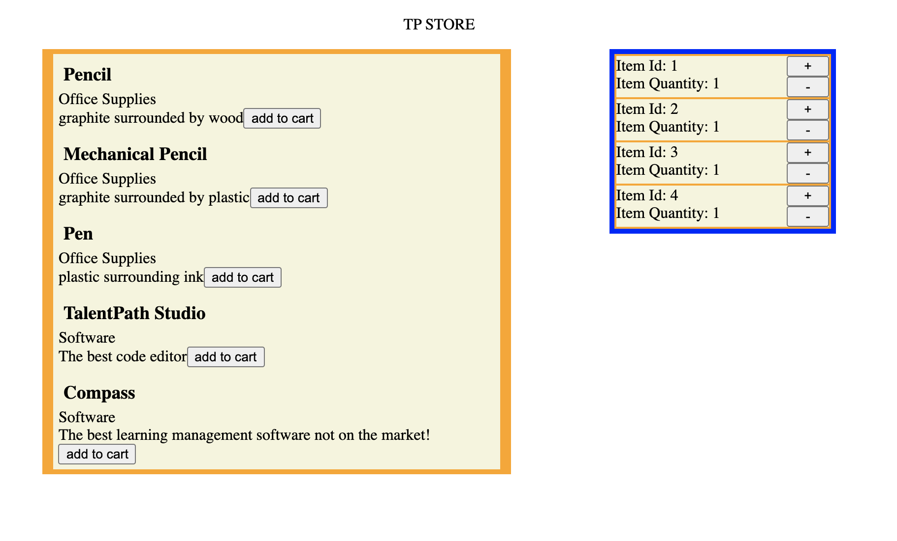

## Introduction ##
In this section, we will be introducing services to our application. Services follow a singleton pattern and are accessible throughout your application. They can serve as a hub for your code to interact with other components, as well as allow you to re-use useful functions.

## Creating a Cart Service ##
Previously, we were storing our cart on a property in the  ``AllProductsComponent`` in ``all-products.component.ts``. The issue with that is our cart data might be important in other sections of our application. In this example we will create a seperate, unlinked component that will pull data from our cart service.

* To create a service, in your integrated terminal run the following command
    * ``ng generate service services/cart``
* In addition, we will create a component named ``cart`` that displays the cart in our components folder
    * ``ng generate component components/cart``
* Navigate to your newly generated ``cart.service.ts``


```Typescript
import { Injectable } from '@angular/core';

@Injectable({
  providedIn: 'root'
})
export class CartService {

  constructor() { }
}

```

Lets go ahead and add some relevant data that will make this service useful.
* create a property named ``cart`` that holds an array of ``CartItem``
* additionally, add an ``addItem()`` function and a ``removeItem()`` function
* finally add a ``getCart()`` function that other components can use to get the cart from the ``cart service ``


```Typescript 

import { Injectable } from '@angular/core';
import { CartItem } from '../cartItem';

@Injectable({
  providedIn: 'root'
})
export class CartService {
  cart : CartItem[] = [];
  constructor() { }
  addToCart(id:number):void {
    let toAdd = this.cart.find(item => item.itemId === id);
    if(toAdd) toAdd.quantity++;
    else this.cart.push({itemId:id, quantity:1})
  }
  removeItem(id:number): void{
    let toRemove = this.cart.find(item => item.itemId === id);
    if(!toRemove) return;
    if(toRemove.quantity <2) this.cart.splice(this.cart.indexOf(toRemove),1);
    else toRemove.quantity--;
  }
  getCart():CartItem[]{
      return this.cart;
  }
}
```

* Now, lets navigate to our ``all-products.component.ts``

We can inject our service into other components by including the service in the constructor for the component class

```Typescript
constructor(private cartService: CartService) { }
```

Now that we have access to our Cart Service, lets refactor our AllProductsComponent to make use of the Cart Service

* In our ngOnInit() instead of initializing a new array for cart, we'll get a reference to the ``cart`` array that lives in our Cart Service
    * Since the cart is an array, the values within the array will updates globally when we access our cart in this fashion.

```Typescript
  ngOnInit(): void {
    this.products = [...productDataSource];
    this.cart = this.cartService.getCart();
  }
```

* Additionally, lets refactor our ``addToCart()`` to make use of the method avaliable to us in the cart service

```Typescript
  addToCart(id:number):void {
    this.cartService.addToCart(id);
  }
```


* Take a moment to play with your website. You'll realize that despite refactoring the component to make use of a cart in the Cart Service, the same functionality still remains. You'll see the same cart display functions working on our all-products component.


## Creating a Cart Display Component ##


* Navigate to our ``app.component.html`` and add the selector for our ``cart.component.html``
    * ``<app-cart>``

```html
<p>{{title.toUpperCase()}}</p>
<app-all-products></app-all-products>
<app-cart></app-cart>
```
* Next, navigate to ``cart.component.html`` and add the following code

```html
<div class="container">
    <div class="cartItem" *ngFor="let cartItem of cart">
        <div class="itemInfo">
            <span class="itemId">Item Id: {{cartItem.itemId}}</span>
            <br>
            <span class="itemQuantity">Quantity: {{cartItem.quantity}}</span>
        </div>
        <div class="buttons">
            <button class="add" (click)="addToCart(cartItem)">+</button>
            <button class="remove" (click)="removeFromCart(cartItem)">-</button>
        </div>
    </div>
    <div *ngIf="cart.length === 0" class="cartItem">
        <span>cart is empty</span>
    </div>
</div>
```

* Next lets add the Typescript for the component, add the ``CartService`` for the component, then pull in the ``cart`` in the ``ngOnInit()`` function


```Typescript 
export class CartComponent implements OnInit {
  cart: CartItem[];
  constructor(private cartService: CartService) { }

  ngOnInit(): void {
    this.cart=this.cartService.getCart();
  }

}
```

You should now see the component at the bottom of of our page, and it will update with items as you press the "add to cart" buttons on each product.



* Next, lets add functionality to the ``+`` and ``-`` buttons
    * Make use of your Cart Service's functions to add and remove items from the cart


```Typescript 
export class CartComponent implements OnInit {
  cart: CartItem[];
  constructor(private cartService: CartService) { }

  ngOnInit(): void {
    this.cart=this.cartService.getCart();
  }
  addToCart(cartItem:CartItem): void {
    this.cartService.addToCart(cartItem.itemId);
  }
  removeFromCart(cartItem:CartItem): void {
    this.cartService.removeItem(cartItem.itemId);
  }

}
```

Now, clicking the ``+`` or ``-`` buttons will increment or decrement the amount of the item in your cart. Something to note is that since both the cart on the ``all-products.component.ts`` and the ``cart.component.ts`` share the same object, they both update whenever any changes are made to the cart



Finally, lets add some styling to the component to make each item visually clearer.


```css
.container {
    border: blue 5px solid;
    width:20%;
    background-color: orange;
}

.cartItem {
    background-color: beige;
    margin: 2px;
}

.itemInfo {
    display: inline-flex;
    flex-direction: column;
    justify-content: space-around;
    width: 80%;
}

.buttons {
    width: 20%;
    display: inline-flex;
    flex-direction: column;
    justify-content: space-around;
}
```



In the CSS here, I use CSS Flexbox to designate the ``itemInfo`` and ``buttons`` div as inline flex containers. Since they become flex containers, I can use ``flex-direction`` to align the items inside vertically with space around. 

I highly recommend learning more css flexbox [here](https://css-tricks.com/snippets/css/a-guide-to-flexbox/)

## Some more styling ##

Using the same methodology, lets align the 2 major components we created in a column format. Navigate to your ``app.component.html`` add classes to each component, as well as create a div that holds the page content.

```html
<div class="title">
    <p>{{title.toUpperCase()}}</p>
</div>
<div class="page">
    <app-all-products class="products"></app-all-products>
    <app-cart class="cart"></app-cart>
</div>
```

We'll add in the following css in order to create a 2 column page layout making use of the same flexbox concepts discussed earlier

```css
.title {
    display: block;
    margin-left: auto;
    margin-right: auto;
    width: fit-content;
}

.products {
    display: inline-block;
    width: 50%;
}

.cart {
    display: inline-block;
    width: 20%;
}

.page {
    width: 80vw;
    margin-left: auto;
    margin-right: auto;
    display: flex;
    justify-content: center;
}
```

```
//cart.component.css
.container {
    border: blue 5px solid;
    //remove width requirements here
    background-color: orange;
}
```

One thing to note is that since the cart changes from a block level element to an inline-block, we'll move the width styling to the outside of the component.

In this case, I set the page container become a block level flex container that hold the 2 components centered and sized according to their width.


Finally, since we have a dedicated cart component, 
* clean up the all-products component by removing the cart information

```html
<div>
    <app-product-display (cartEmitter)="addToCart($event)" *ngFor="let product of products" [product]="product"></app-product-display>
</div>
```
```Typescript 
export class AllProductsComponent implements OnInit {
  products: Product[];
  
  constructor(private cartService: CartService) { }

  ngOnInit(): void {
    this.products = [...productDataSource];
    
  }
  addToCart(id:number):void {
    this.cartService.addToCart(id);
  }


}
```

finally, we're left with a page that looks like this:



[previous: container component](./containerComponent.md) || [next: refactoring to a product service](./productService.md)


